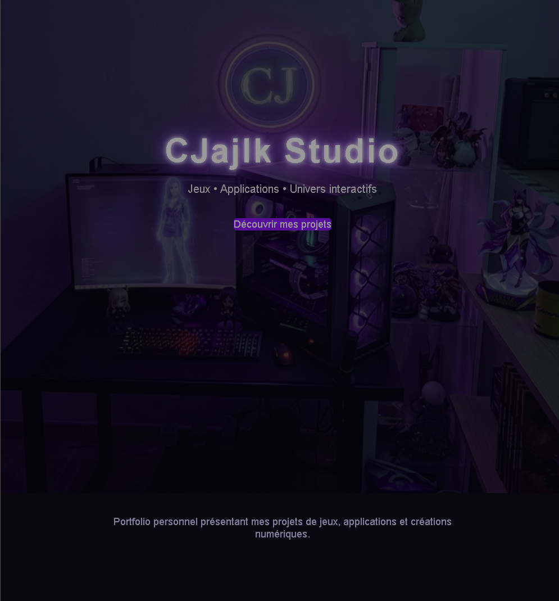

# 🌙 CJajlk Studio

Portfolio personnel présentant mes projets de création numérique.

Ce site rassemble différents projets liés aux jeux, aux applications et aux univers créatifs développés de manière indépendante.

## Aperçu du site

---

## 🎮 Projets

Ce portfolio présente :

- Jeux jouables
- Prototypes en développement
- Applications expérimentales
- Univers créatifs (livres et peintures)
- Outils personnels

---

## 🌐 Écosystème CJajlk

🔹 **CJajlkGames**  
https://cjajlk.github.io/cjajlkGames/

🔹 **CJajlkBook**  
https://cjajlk.github.io/cjajlkbook/

🔹 **CJajlkArt**  
https://cjajlk.github.io/cjajlkart/

---

## 🧰 Technologies explorées

- HTML
- CSS
- JavaScript
- Python
- Blender (3D)
- OBS Studio
- Expérimentation Google Play

---

## 🚀 Objectif

Développer progressivement un studio indépendant de création numérique et expérimenter différents types de projets interactifs.

---

## 📌 Statut

Projet personnel en évolution.

---

© CJajlk Studio
